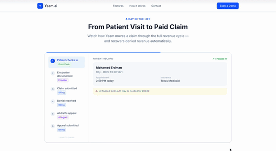

# Yeam.ai — AI-Powered EHR System

A full-stack Electronic Health Record (EHR) system for Yeam Health Clinic, built with Next.js 16, tRPC, Prisma, and Google Gemini AI agents.

---

## Day in the Life



---

## Project Map

```
yeam_agent_system/
├── app/
│   ├── (auth)/
│   │   └── login/page.tsx            # Login page
│   ├── (dashboard)/
│   │   ├── layout.tsx                # Dashboard shell (sidebar + header)
│   │   ├── page.tsx                  # Home dashboard (metrics + today's appointments)
│   │   ├── patients/
│   │   │   ├── page.tsx              # Patient list
│   │   │   └── [id]/page.tsx         # Patient detail
│   │   ├── appointments/page.tsx     # Daily schedule
│   │   ├── encounters/
│   │   │   ├── page.tsx              # Encounter list
│   │   │   └── [id]/page.tsx         # SOAP note editor
│   │   ├── claims/page.tsx           # Claims management
│   │   ├── billing/page.tsx          # Denial management + appeals
│   │   └── analytics/page.tsx        # Charts + NL query box
│   ├── api/
│   │   ├── agents/
│   │   │   ├── chat/route.ts         # Gemini orchestrator (intent → tools → SSE stream)
│   │   │   └── stream/route.ts       # Agent dispatch SSE stream (used by NLQueryBox)
│   │   ├── auth/[...nextauth]/       # NextAuth v5 handler
│   │   ├── healthz/route.ts          # Health check endpoint
│   │   ├── medicaid/                 # REST endpoints for Medicaid dataset
│   │   │   ├── analytics/route.ts
│   │   │   ├── claims/route.ts
│   │   │   ├── encounters/route.ts
│   │   │   ├── patients/route.ts
│   │   │   └── providers/route.ts
│   │   └── trpc/[trpc]/route.ts      # tRPC handler
│   ├── globals.css
│   └── layout.tsx                    # Root layout
│
├── components/
│   ├── analytics/
│   │   ├── AnalyticsView.tsx         # Summary metrics, charts, top diagnoses
│   │   ├── DenialRateChart.tsx       # Recharts denial trend line
│   │   ├── NLQueryBox.tsx            # Natural-language query → analytics agent
│   │   └── RevenueChart.tsx          # Recharts revenue bar chart
│   ├── appointments/
│   │   ├── AppointmentsView.tsx      # Schedule table (check-in, cancel, delete)
│   │   └── CancelAppointmentDialog.tsx
│   ├── billing/
│   │   ├── BillingView.tsx
│   │   └── DeniedClaimCard.tsx
│   ├── claims/ClaimsView.tsx
│   ├── dashboard/
│   │   ├── AppointmentList.tsx       # Today's appointments widget
│   │   └── MetricsCards.tsx          # KPI cards
│   ├── encounters/
│   │   ├── EncounterEditor.tsx       # SOAP note editor
│   │   ├── EncounterList.tsx         # Encounter table (view, delete)
│   │   └── SOAPAssistDialog.tsx      # AI-assisted SOAP generation
│   ├── layout/
│   │   ├── AgentActivityFeed.tsx     # Live agent event log
│   │   ├── CommandBar.tsx            # ⌘K command palette → agent chat
│   │   ├── Header.tsx
│   │   └── Sidebar.tsx
│   ├── patients/
│   │   ├── PatientDetail.tsx
│   │   └── PatientTable.tsx
│   └── ui/                           # Radix UI primitives (button, card, badge, etc.)
│
├── lib/
│   ├── agents/
│   │   ├── analytics-agent.ts        # Queries live DB metrics, then calls Gemini
│   │   ├── base-agent.ts             # Streaming base class + DB logging
│   │   ├── billing-agent.ts          # Appeal letter generation
│   │   ├── claim-scrubber-agent.ts   # Claim validation
│   │   ├── clinical-doc-agent.ts     # SOAP / coding assistance
│   │   ├── front-desk-agent.ts       # Check-in, scheduling, patient lookup
│   │   ├── gemini-client.ts          # Gemini model factory
│   │   ├── orchestrator.ts           # Routes intent to correct agent
│   │   └── types.ts                  # AgentTask, AgentEvent, AgentName
│   ├── ai/
│   │   ├── medicaid-tools.ts         # Gemini function declarations (Medicaid data)
│   │   └── tool-executor.ts          # Executes Medicaid tool calls
│   ├── trpc/
│   │   ├── client.ts                 # tRPC client
│   │   └── provider.tsx              # React Query + tRPC provider
│   ├── auth.ts                       # NextAuth v5 config (credentials + JWT)
│   ├── db.ts                         # Prisma singleton
│   └── utils.ts                      # cn() class utility
│
├── server/trpc/
│   ├── context.ts                    # tRPC request context (prisma + session)
│   ├── trpc.ts                       # protectedProcedure, publicProcedure
│   └── router/
│       ├── index.ts                  # Root router
│       ├── analytics.ts              # getSummaryMetrics, getRevenueByDay, getDenialTrend, getTopDiagnoses
│       ├── appointments.ts           # list, checkIn, updateStatus, cancel, delete
│       ├── claims.ts
│       ├── dashboard.ts
│       ├── encounters.ts             # list, getById, updateSOAP, sign, addDiagnosis, removeDiagnosis, delete
│       └── patients.ts
│
├── prisma/
│   ├── schema.prisma                 # 11 EHR tables + Medicaid tables + NextAuth tables
│   └── seed.ts                       # Demo data (4 users, 3 providers, 5 payers, 20 patients, 30 appts)
│
├── scripts/
│   ├── load-medicaid-data.ts         # Bulk-loads TX Medicaid CSV (2022–2024, year-aggregated)
│   ├── seed-medicaid-demo.ts
│   └── TODO.md
│
├── __tests__/                        # Vitest test suite
│   ├── task1-remove-molina.test.ts   # No Molina references in source
│   ├── task2-analytics-agent.test.ts # Analytics agent uses live DB data
│   └── task3-delete-mutations.test.ts# Delete procedures exist on routers
│
├── public/
├── .env.example
├── next.config.ts
├── proxy.ts                          # Next.js 16 middleware entrypoint
├── vercel.json
├── vitest.config.ts
└── package.json
```

---

## Tech Stack

| Layer | Technology |
|---|---|
| Framework | Next.js 16 (App Router, Turbopack) + React 19 + TypeScript |
| Styling | Tailwind CSS v4 |
| Database | PostgreSQL + Prisma v6 |
| Auth | NextAuth v5 — credentials provider, JWT session |
| API | tRPC v11 + React Query v5 |
| AI | Google Gemini 2.5 Flash (`@google/generative-ai`) |
| Testing | Vitest |
| Package manager | pnpm |

---

## Features

### Clinical Workflow
- **Patients** — searchable table with demographics, MRN, insurance, and full detail view
- **Appointments** — daily schedule with date/status filters, one-click check-in, cancel (with reason + audit trail), and hard delete
- **Encounters** — SOAP note editor with AI Assist and hard delete
- **Claims** — claim status tracking and denial management
- **Billing** — AI-generated appeal letters for denied claims
- **Analytics** — revenue chart, denial rate trend, top diagnoses, and natural-language query box (backed by live DB data)

### AI Agent System

Five specialized agents routed via Gemini intent classification:

| Agent | Handles |
|---|---|
| **Front Desk** | Check-ins, scheduling, cancellations, patient lookup, insurance verification |
| **Clinical Doc** | SOAP notes, encounter documentation, ICD-10/CPT coding |
| **Claim Scrubber** | Claim validation, code review, status checks |
| **Billing** | Denied claims, appeal letters, revenue cycle |
| **Analytics** | Live DB metrics (encounters, denial rate, revenue), trend analysis, Medicaid statewide data |

The **Command Bar** (⌘K) routes natural-language queries to the correct agent, executes live database lookups via Gemini function calling, and streams responses back in a persistent chat panel.

Agents degrade gracefully when `GEMINI_API_KEY` is not set — they query the database and return a structured stub response instead.

### Texas Medicaid Dataset
Optionally load 11M+ statewide TX Medicaid claims (2022–2024) for analytics and provider benchmarking via `pnpm db:seed-medicaid`.

---

## Getting Started

### Prerequisites
- Node.js 20+
- pnpm
- PostgreSQL

### Setup

```bash
# Install dependencies
pnpm install

# Create the local database
createdb yeam_dev

# Copy and fill in environment variables
cp .env.example .env

# Run migrations
pnpm prisma migrate dev

# Seed demo data
pnpm db:seed

# Start dev server (http://localhost:3000)
pnpm dev
```

### Environment Variables

| Variable | Required | Description |
|---|---|---|
| `DATABASE_URL` | Yes | PostgreSQL connection string (pooled for Supabase) |
| `DIRECT_URL` | Yes (Supabase) | Direct PostgreSQL connection string (non-pooled, for migrations) |
| `AUTH_SECRET` | Yes | NextAuth secret — generate with `openssl rand -base64 32` |
| `NEXTAUTH_URL` | Yes | App URL, e.g. `http://localhost:3000` |
| `GEMINI_API_KEY` | No | Google AI Studio key — agents stub gracefully without it |

### Demo Credentials (password: `demo1234`)

| Role | Email |
|---|---|
| Admin | admin@yeam.demo |
| Provider | provider@yeam.demo |
| Front Desk | frontdesk@yeam.demo |
| Billing | billing@yeam.demo |

---

## Scripts

| Command | Description |
|---|---|
| `pnpm dev` | Start dev server (Turbopack, port 3000) |
| `pnpm build` | `prisma generate` + `next build` |
| `pnpm test` | Run Vitest test suite |
| `pnpm db:seed` | Seed demo users, patients, appointments, claims |
| `pnpm db:seed-medicaid` | Load TX Medicaid CSV dataset (requires `state_TX.csv`) |
| `pnpm db:migrate` | Run Prisma migrations |
| `pnpm db:studio` | Open Prisma Studio |

---

## Deployment (Vercel + Supabase)

See [`DEPLOY.md`](./DEPLOY.md) for the full step-by-step guide. Summary:

1. Provision a free Supabase PostgreSQL database
2. Push repo to GitHub
3. Import into Vercel — set `DATABASE_URL`, `DIRECT_URL`, `AUTH_SECRET`, `NEXTAUTH_URL`, optionally `GEMINI_API_KEY`
4. Run `prisma migrate deploy` against the production DB
5. Run `pnpm db:seed` to create demo accounts

---

## Key Design Decisions

- **`proxy.ts`** instead of `middleware.ts` — Next.js 16 renamed the middleware entrypoint
- **`AUTH_SECRET`** instead of `NEXTAUTH_SECRET` — NextAuth v5 convention
- **`DIRECT_URL`** alongside `DATABASE_URL` — required by Prisma when using Supabase's connection pooler (pgBouncer); `DATABASE_URL` is the pooled URL, `DIRECT_URL` is the direct connection used for migrations
- Prisma `Decimal` fields call `.toNumber()` before returning from tRPC procedures
- Agent logs are written fire-and-forget to avoid blocking the SSE stream
- Gemini function calling: Flash model classifies intent, Flash executes with tools + conversation history
- Analytics agent fetches live DB metrics (encounter count, denial rate, revenue) before every Gemini call — no hardcoded stub data
