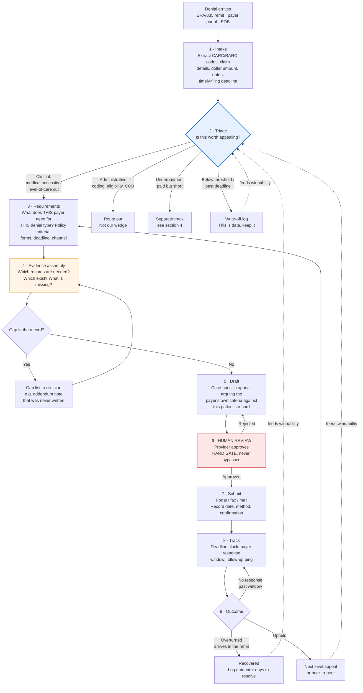

# Yeam agent — what we are actually building

*Written 2026-09-10. Source: two independent conversations, five days apart, that described the same
pipeline without being asked the same question.*

> ⚠ **This is product spec, not GTM.** Per the 8/30 decision in `log.md` (GTM copy lives in this
> workspace, product lives in the product repos), this file should be moved into the agent repo. It is
> sitting here only because that is where it got written.

---

## 1. The finding

Two people who know this industry described the same workflow, unprompted, without knowing about each
other:

| | Who | When | What they said |
|---|---|---|---|
| **A** | RCM professional, inbound from the 8/30 Reddit post | Sat 2026-09-05 | Claim **categorization** · **ease of working with them** · a connected EHR→payer flow |
| **B** | Reddit commenter on the follow-up post | ~2026-09-08 | Understanding **why** it was denied (remit + reason codes) · gathering **supporting documents**, which often takes longer than the letter · **tracking and follow-up** after submission · **underpayments** count too · **human review** before anything goes out |

**The convergent point: writing the letter is the smallest part of the job.**

Drafting is one step out of nine. The time and the money sit in triage before it and tracking after it.
This matches what we already concluded from the inside, for different reasons:

- **B8** — a generated letter is a $5 commodity (EZAppeal). We sell the work done, not the letter.
- **B4** — the aging report says what is unpaid, but the **reason code lives only in the ERA**. The
  reason code is the whole filter.
- **B3** — a won appeal produces **no letter**. The overturn shows up **in the remit**. So tracking is
  not a feature, it is the only meter that exists.

Two outside sources independently arrived at findings we had already made internally. That is the
strongest signal we have that the pipeline below is the right shape.

---

## 2. The pipeline

**Two things to notice in that diagram.**

1. **The dotted lines back into Triage are the whole business.** Every outcome, including every
   write-off, teaches the categorizer what is worth appealing. That is what source A meant by "claim
   categorization." It is not a taxonomy someone writes once. It is a model that gets better every
   time a claim resolves, and it is the only part of this that compounds.
2. **Steps 2 and 4 are orange and blue for a reason.** Triage and evidence assembly are where both
   sources said the time actually goes. Step 5, the draft, is the part everyone else is selling.

---

## 3. Stage detail

| # | Stage | Input | Agent does | Output | Human |
|---|---|---|---|---|---|
| 1 | Intake | Remit / portal / EOB | Parse reason codes, claim data, dates | Structured denial record | None |
| 2 | Triage | Denial record + history | Classify bucket, score winnability, check deadline and dollar threshold | Appeal / write-off / route out | Reviews the borderline ones |
| 3 | Requirements | Payer + denial type | Look up that payer's medical policy, appeal instructions, forms, channel, deadline | Requirement checklist | None |
| 4 | Evidence assembly | Checklist + available records | Match records to requirements, produce the **gap list** | Assembled packet or gap list | Clinician fills real gaps |
| 5 | Draft | Packet + policy criteria | Argue the payer's own criteria against this record | Draft appeal | None yet |
| 6 | Review | Draft | Present for approval, show its reasoning | Approved / edited | ⛔ **Required. Hard gate.** |
| 7 | Submit | Approved appeal | Submit, capture confirmation | Submission record | Depends on channel |
| 8 | Track | Submission record | Watch the clock, ping on silence | Status + follow-ups | Escalation calls |
| 9 | Outcome | Remit / letter / silence | Record result, update winnability | Outcome record | None |

---

## 4. What we are deliberately NOT building

These were considered and rejected on specific dates. They are recorded here so nobody re-opens them
in month three thinking they found something new.

**⛔ The full EHR → payer automation flow.** Source A's third point, flagged and not adopted on 9/6.
That product exists and is called a clearinghouse: Availity, Waystar, Change, plus every EHR's own
submission path. Competing there means fighting funded infrastructure on its home ground, it is a
multi-year integration build (payer connections, 837/835, EHR APIs, SFTP, per-payer quirks), and it is
the opposite of our position, which is to sell the work done rather than the pipe.

**⛔ Underpayment recovery as part of v1.** Source B is right that underpayments are real money. They
are also a **different job**: comparing allowed against contracted rate, which is contract-variance
analytics, not clinical argument. Different data, different competitors, different buyer conversation.
It gets its own track on the diagram and it is not in the first build.
*Open question worth asking a biller: do the same people work both queues, or is it two teams?*

**⛔ Administrative denials.** Coding, eligibility, COB. High volume, low value per claim, and it is
what everyone else already automates. Note the tension with **B10**: only about 5% of denials are
medical necessity, and our defence is that the datasets exclude prior auth, where level-of-care cuts
actually live. Staying clinical is the bet. Do not drift administrative because the volume looks nicer.

---

## 5. Hard constraints

1. **Human review before submission. Always.** Both sources said it independently, and it is already
   in our positioning. It is a design constraint, not a setting.
2. **No PHI in the system if it can be avoided.** B2 is only asleep because there is no PHI. Every
   clean route to the remit reactivates it. Design intake so the clinic self-reports where possible.
3. **The reason code lives in the ERA, not the aging report.** Do not build intake against an aging
   export and assume the codes will be there.
4. **A won appeal produces no letter.** The overturn arrives in the remit. Outcome tracking has to read
   remits, not wait for correspondence.
5. **Minimise what the human has to do.** Source A's second point, "ease of working with them," is the
   vaguest and probably the most important. A billing shop's constraint is **hours**. Anything that
   adds a portal, a login, or a new place to check is disqualifying no matter how good the output is.
   Every stage above should remove clicks, not add them.

---

## 6. Open questions

Not guesses to resolve internally. Questions to put to a real biller.

- How long does evidence assembly actually take, and what is the split between hunting for records
  that exist and waiting on notes that were never written? *(Asked in the Reddit reply, 9/10.)*
- What is a "category" in practice? By CARC code, by payer, by dollar band, or by winnability?
  *(Source A said categorization and we never pinned down what he meant.)*
- Is there a dollar threshold below which nobody appeals, and what is it?
- Does the peer-to-peer usually settle it anyway, making the written appeal secondary?
- Do the same people work denials and underpayments?

---

# 📍 60-second version
> *Written 2026-09-10.*

**What this file is:** the build spec for the Yeam agent, derived from two independent industry
conversations that described the same pipeline five days apart.

1. **Writing the letter is the smallest part.** Nine stages; drafting is one of them. The time is in
   **triage** (stage 2) and **evidence assembly** (stage 4). That is also where the defensibility is,
   because a generated letter is a $5 commodity.
2. **The feedback loop is the business.** Every outcome, including write-offs, feeds winnability back
   into triage. That is the only part that compounds.
3. **Human review is a hard gate**, and three findings from `blockers.md` constrain the design: the
   reason code lives in the **ERA**, a won appeal produces **no letter** (it arrives in the remit), and
   **no PHI** keeps B2 asleep.
4. **Not building:** the EHR→payer clearinghouse, underpayment contract-variance, or administrative
   denials. All three were considered and rejected with reasons in section 4.
